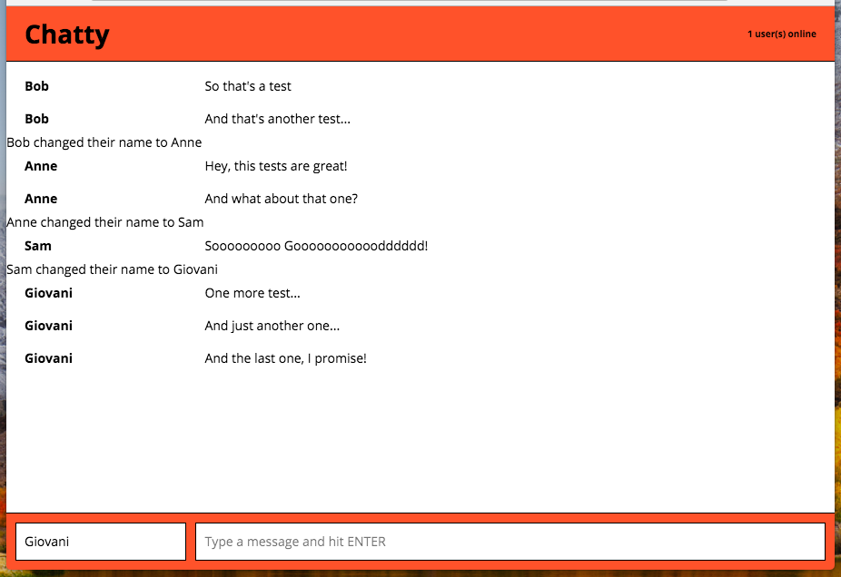
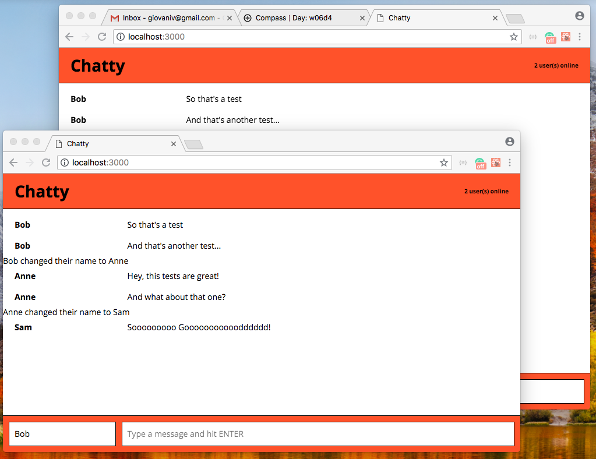
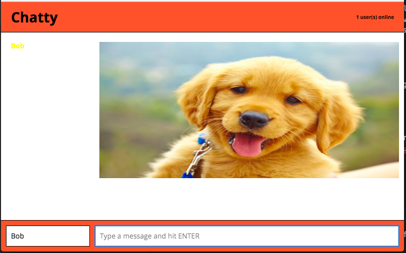

# Chatty Project

Chatty is a simple WEB application developed to self-study purpose.
Front-end was made with HTML, CSS, React.js and JavaScript.
Back-end was made with Node, Express and WebSockets.

### Static Files

You can store static files like images, fonts, etc in the `build` folder.
For example, if you copy a file called my_image.png into the build folder you can access it using `http://localhost:3000/build/my_image.png`.

### Inserting Images in the Chatty

You can send images in the chat room inserting your .gif, .png or .jpg URL between tags.
For Example: `<http://cdn3-www.dogtime.com/assets/uploads/2011/03/puppy-development.jpg>`.

## Getting Started

1. Fork this repository and after that `git clone` your new forked repository
2. `npm install` to install all dependencies of the project
3. `npm start` to run start chatty client
4. In other terminal window go to `chatty_server` folder, run `node server.js` to start chatty server
5. Go to `https://localhost:3000` to enter in the chatty web app

### Linting

This boilerplate project includes React ESLint configuration with `npm run lint`

## Dependencies

* React
* Webpack
* [babel-loader](https://github.com/babel/babel-loader)
* [webpack-dev-server](https://github.com/webpack/webpack-dev-server)

## Screeshots

